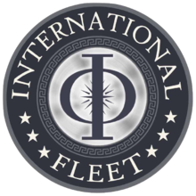

## Learn ansible with docker

(Read with Mazer Rackham´s voice)

Welcome to the International Fleet officer trainer simulator! Where we thin out the future officers from the herd! We will prepare you to send commands across the galaxy to multiple starfigthers at the same time, to defeat those formic b#stards!

(Lore will continue)

This labs consists of two kinds of containers:

 * ansible_philote: To give commands
 * Starships: To receive commands across the galaxy

### To-do
 - [x] Create ansible_philote image
 - [x] Create launcher script
 	- [x] Build images and launch docker-compose
 - [x] Create docker-compose.yaml
 	- [x] Working with ansible_philote
 	- [x] Working with ~~starfighter 1~~ Bajovnick
 	- [ ] Working with ~~starfighter 2~~ Herodotus
 	- [ ] Working with ~~starfighter 3~~ Makarhu
 	- [x] Find cool names for starfigthers
 - [x] Create some cool asci art
 - [ ] Create dificulty levels
 	- [ ] Lvl 0. 1 Remote ship, same ship model
	- [ ] lvl 1. 3 remote ship, same ship model
	- [ ] lvl 2. 3 remote ship, different ship model
	- [ ] lvl 3. 9 remote ship, different ship model in squads
 - [ ] Integrate dificulti levels in launcher
 - [ ] Narrative FFS!!!!
